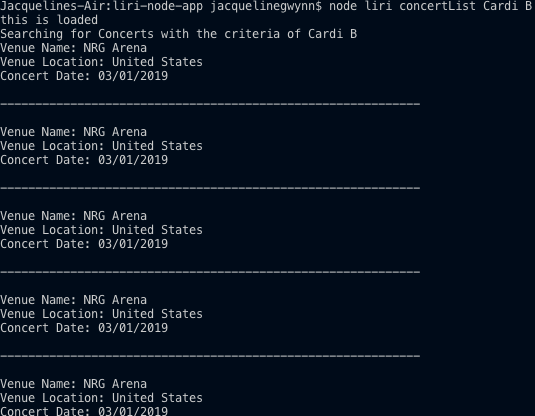
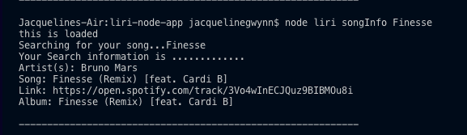

# liri-node-app
week 10 LIRI assignment
 
## LIRI Bot
##### Overview
In this assignment, you will make LIRI. LIRI is like iPhone's SIRI. However, while SIRI is a Speech Interpretation and Recognition Interface, LIRI is a Language Interpretation and Recognition Interface. LIRI will be a command line node app that takes in parameters and gives you back data.

*LIRI will search Spotify for songs, Bands in Town for concerts, and OMDB for movies.
*Node-Spotify-API
*Axios
*Moment
*DotEnv

## Screen shots

### Band In Town 

### Spotify API 

### OMBD API 

* .gitignore file 
node_modules
.DS_Store
.env

*Make a JavaScript file named keys.js.
Inside keys.js your file will look like this:
console.log('this is loaded');

exports.spotify = {
  id: process.env.SPOTIFY_ID,
  secret: process.env.SPOTIFY_SECRET
};
Next, create a file named .env, add the following to it, replacing the values with your API keys (no quotes) once you have them:

# Spotify API keys

SPOTIFY_ID=your-spotify-id
SPOTIFY_SECRET=your-spotify-secret
This file will be used by the dotenv package to set what are known as environment variables to the global process.env object in node. These are values that are meant to be specific to the computer that node is running on, and since we are gitignoring this file, they won't be pushed to github — keeping our API key information private.

If someone wanted to clone your app from github and run it themselves, they would need to supply their own .env file for it to work.
